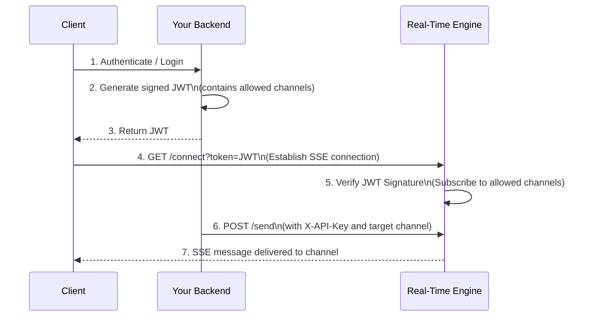

## Base URL

All API endpoints are relative to your engine's base URL:

<CodeGroup>
```bash Development
http://localhost
```
```bash Production
https://realtime.yourcompany.com
```

</CodeGroup>

## Endpoints

The Real-Time Engine exposes three main endpoints:

<CardGroup cols={3}>
  <Card
    title="Connect"
    icon="plug"
    href="/api-reference/connect"
  >
    Establish SSE connection
  </Card>
  <Card
    title="Send"
    icon="paper-plane"
    href="/api-reference/send"
  >
    Publish message to channel
  </Card>
  <Card
    title="Acknowledge"
    icon="check"
    href="/api-reference/ack"
  >
    Confirm message receipt
  </Card>
</CardGroup>

## Authentication and Security

The engine supports two layers of authentication:

1. **Client-to-Gateway Security (JWT Mode):** Managed statelessly using JSON Web Tokens (JWT) verified via a shared `JWT_SECRET`. Clients connect via `/connect?token={token}` and `/ack` with their credentials.
2. **Server-to-Gateway Security (API Key):** Protected using the `REALTIME_API_KEY` secret. All administrative publishing calls to `/send` must include the `X-API-Key` header.

### Secure Sequence Flow



---

## Error Handling

All endpoints return standard HTTP status codes:

| Code | Meaning |
|:-----|:--------|
| 200 | Success |
| 400 | Bad Request (invalid JSON or missing required fields) |
| 401 | Unauthorized (invalid or missing JWT token / API Key) |
| 500 | Internal Server Error |

---

## Message Format

Messages are broadcast to clients in this JSON format:
```json
{
  "type": "broadcast",
  "payload": {
    "channel": "room_A",
    "data": {
      "type": "notification",
      "title": "Alert",
      "message": "System Update"
    }
  },
  "room_id": "room_A"
}
```