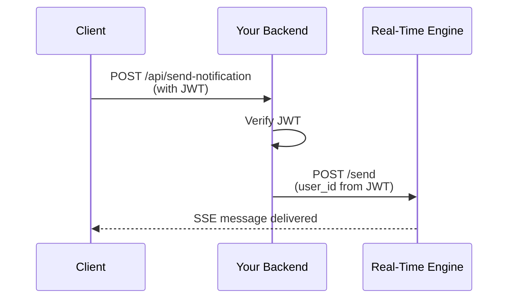

## Base URL

All API endpoints are relative to your engine's base URL:

<CodeGroup>
```bash Development
http://localhost
```
```bash Production
https://realtime.yourcompany.com
```

</CodeGroup>

## Endpoints

The Real-Time Engine exposes three main endpoints:

<CardGroup cols={3}>
  <Card
    title="Connect"
    icon="plug"
    href="/api-reference/connect"
  >
    Establish SSE connection
  </Card>
  <Card
    title="Send"
    icon="paper-plane"
    href="/api-reference/send"
  >
    Send message to user
  </Card>
  <Card
    title="Acknowledge"
    icon="check"
    href="/api-reference/ack"
  >
    Confirm message receipt
  </Card>
</CardGroup>

## Authentication

<Warning>
This engine does not include built-in authentication. You must implement auth in your backend before calling `/send`.
</Warning>

Recommended flow:


Example in Python:
```python
from flask import request
import jwt

@app.route('/send_notification', methods=['POST'])
def send_notification():
    # Verify user is authenticated
    token = request.headers.get('Authorization')
    user = jwt.decode(token, SECRET_KEY)
    
    # Publish to engine
    requests.post('http://realtime-engine/send', json={
        'message': request.json['message'],
        'to_user': user['id']
    })
    
    return {'status': 'sent'}
```

## Error Handling

All endpoints return standard HTTP status codes:

| Code | Meaning |
|:-----|:--------|
| 200 | Success |
| 400 | Bad Request (invalid JSON or missing required fields) |
| 500 | Internal Server Error |

Error response format:
```json
{
  "error": "id param required"
}
```

## Message Format

Messages are broadcast in this JSON format:
```json
{
  "type": "broadcast",
  "payload": {
    "message": "Your notification here",
    "to_user": "user_123",
    "timestamp": "2026-01-25T10:30:00Z"
  },
  "roomID": "general"
}
```

<Info>
The current implementation uses a single room called "general". Multi-room support can be added by modifying the Subscribe channel.
</Info>