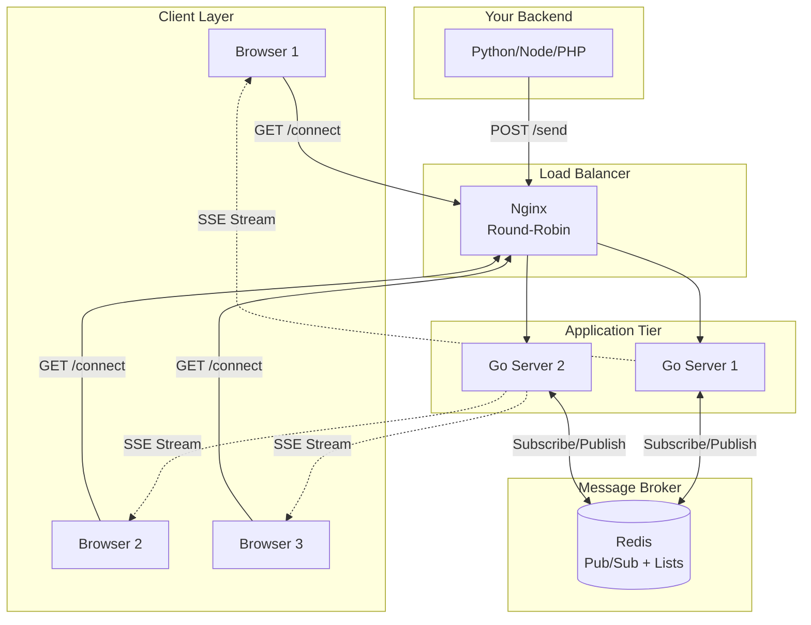
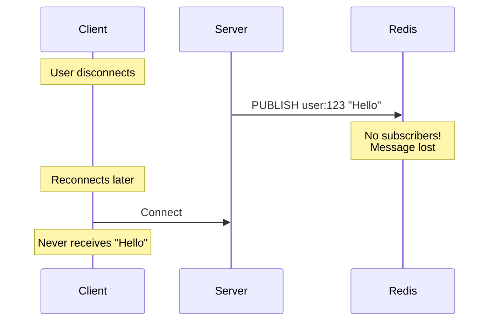
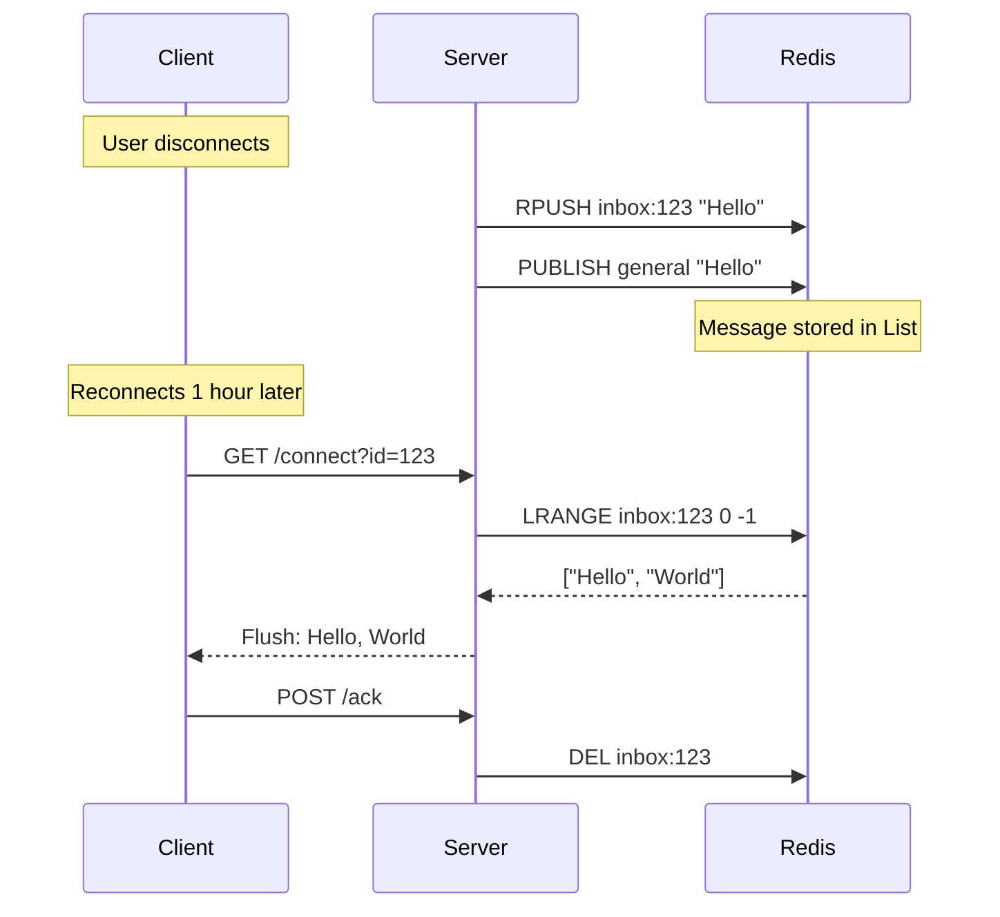

## System Overview

The engine is built on three core principles:

<CardGroup cols={3}>
  <Card title="Stateless" icon="server">
    Application servers hold no state. They can crash, restart, or scale without data loss.
  </Card>
  <Card title="Distributed" icon="network-wired">
    Redis Pub/Sub synchronizes all server instances in real-time.
  </Card>
  <Card title="Reliable" icon="shield-check">
    The Inbox Pattern ensures messages persist until acknowledged.
  </Card>
</CardGroup>

## High-Level Architecture


## Component Deep Dive

### 1. Nginx Load Balancer

**Role:** Entry point for all traffic. Distributes requests across Go instances.

**Key Features:**
- Least connections algorithm (routes to least busy server)
- SSE-optimized (disables buffering and caching)
- Automatic health checks

**Configuration:**
```nginx
upstream backend {
    least_conn;
    server server_a:8080;
    server server_b:8080;
}

server {
    listen 80;
    
    location /connect {
        proxy_pass http://backend;
        proxy_http_version 1.1;
        proxy_set_header Connection "";
        proxy_buffering off;  # Critical for SSE
        proxy_cache off;
    }
}
```

<Tip>
`least_conn` ensures new SSE connections go to the least loaded server, preventing hot spots.
</Tip>

### 2. Go Application Servers

**Role:** Handle SSE connections and process incoming messages.

**Key Characteristics:**
- Stateless (no local storage of messages)
- Goroutine-based concurrency (10k+ connections per instance)
- Fast Redis integration with connection pooling

**Code Structure:**
```go
// Manager handles all active clients
type Manager struct {
    clients    map[*Client]bool
    Register   chan *Client
    Unregister chan *Client
    Broadcast  chan []byte
}

// Client represents a single SSE connection
type Client struct {
    ID   string
    Send chan []byte  // Buffered channel (256 messages)
}
```

**Lifecycle:**
1. Client connects via `/connect?id=user_123`
2. Server creates Client struct with buffered channel
3. Server fetches pending messages from Redis
4. Server flushes pending messages to client
5. Server registers client with Manager
6. Manager subscribes to Redis channel "general"
7. On new message, Manager broadcasts to all clients
8. On disconnect, Server unregisters client

### 3. Redis (Dual Role)

Redis serves two critical functions:

<Tabs>
  <Tab title="Pub/Sub (Real-Time Sync)">
    **Purpose:** Synchronize messages across all server instances.
    
    **How it works:**
```go
    // Server A receives POST /send
    redisBroker.Publish(ctx, "general", messageData)
    
    // All servers subscribed to "general" receive it
    msgChan, cleanup, _ := redisBroker.Subscribe(ctx, "general")
    for msg := range msgChan {
        manager.Broadcast <- msg  // Forward to connected clients
    }
```
    
    **Result:** Message sent to Server A is delivered by Server B (which holds the SSE connection).
  </Tab>
  
  <Tab title="Lists (Inbox Pattern)">
    **Purpose:** Store messages for disconnected users.
    
    **How it works:**
```go
    // On POST /send with to_user
    if targetUser != "" {
        redisBroker.SaveMessage(ctx, targetUser, messageData)
        // Stored as: RPUSH inbox:user_123 <message>
    }
    
    // On GET /connect
    missedMsgs, _ := redisBroker.GetPendingMessages(ctx, clientID)
    // Fetched as: LRANGE inbox:user_123 0 -1
    
    for _, msg := range missedMsgs {
        client.Send <- msg  // Deliver immediately
    }
    
    // On POST /ack
    redisBroker.ClearInbox(ctx, userID)
    // Cleared as: DEL inbox:user_123
```
    
    **Result:** Messages persist for 24 hours (configurable TTL) until acknowledged.
  </Tab>
</Tabs>

## The Inbox Pattern (Deep Dive)

The Inbox Pattern is what makes this engine reliable.

### Problem: Fire-and-Forget Pub/Sub

Traditional Pub/Sub:


### Solution: Inbox Pattern

With persistence:


### Implementation Details

**Saving messages:**
```go
func (b *RedisBroker) SaveMessage(ctx context.Context, userID string, msg []byte) error {
    key := "inbox:" + userID
    
    pipe := b.Client.Pipeline()
    pipe.RPush(ctx, key, msg)
    pipe.Expire(ctx, key, 24*time.Hour)  // Auto-cleanup after 24h
    
    _, err := pipe.Exec(ctx)
    return err
}
```

**Retrieving messages:**
```go
func (b *RedisBroker) GetPendingMessages(ctx context.Context, userID string) ([][]byte, error) {
    key := "inbox:" + userID
    result, err := b.Client.LRange(ctx, key, 0, -1).Result()  // Get all
    
    // Convert to [][]byte
    msgs := make([][]byte, len(result))
    for i, s := range result {
        msgs[i] = []byte(s)
    }
    return msgs, nil
}
```

**Clearing inbox (atomic):**
```go
func (b *RedisBroker) ClearInbox(ctx context.Context, userID string) ([][]byte, error) {
    script := redis.NewScript(`
        local msgs = redis.call('LRANGE', KEYS[1], 0, -1)
        redis.call('DEL', KEYS[1])
        return msgs
    `)
    
    result, err := script.Run(ctx, b.Client, []string{key}).Result()
    // ... conversion
}
```

<Info>
Using a Lua script ensures the read-and-delete operation is atomic, preventing race conditions.
</Info>

## Message Flow (Step by Step)

Let's trace a message from your backend to the client:

<Steps>
  <Step title="Your Backend Sends">
```python
    requests.post('http://engine/send', json={
        'message': 'New notification!',
        'to_user': 'user_123'
    })
```
  </Step>

  <Step title="Nginx Routes">
    Request hits Server A (random - could be any instance)
  </Step>

  <Step title="Server A Processes">
```go
    targetUser := payload["to_user"]  // "user_123"
    
    msg := engine.Message{
        Type: "broadcast",
        Payload: payload,
        RoomID: "general",
    }
    
    // Save to inbox
    redisBroker.SaveMessage(ctx, "user_123", msgData)
    
    // Publish for real-time
    redisBroker.Publish(ctx, "general", msgData)
```
  </Step>

  <Step title="Redis Broadcasts">
    All servers subscribed to "general" receive the message.
    
    Server B is holding the SSE connection for user_123.
  </Step>

  <Step title="Server B Delivers">
```go
    // Manager receives from Redis
    msg := <-msgChan
    manager.Broadcast <- msg
    
    // Manager forwards to all clients
    for client := range manager.clients {
        client.Send <- msg  // Non-blocking thanks to buffer
    }
```
  </Step>

  <Step title="Client Receives">
    The client receives the message through the SSE stream and updates the UI.
  </Step>
</Steps>