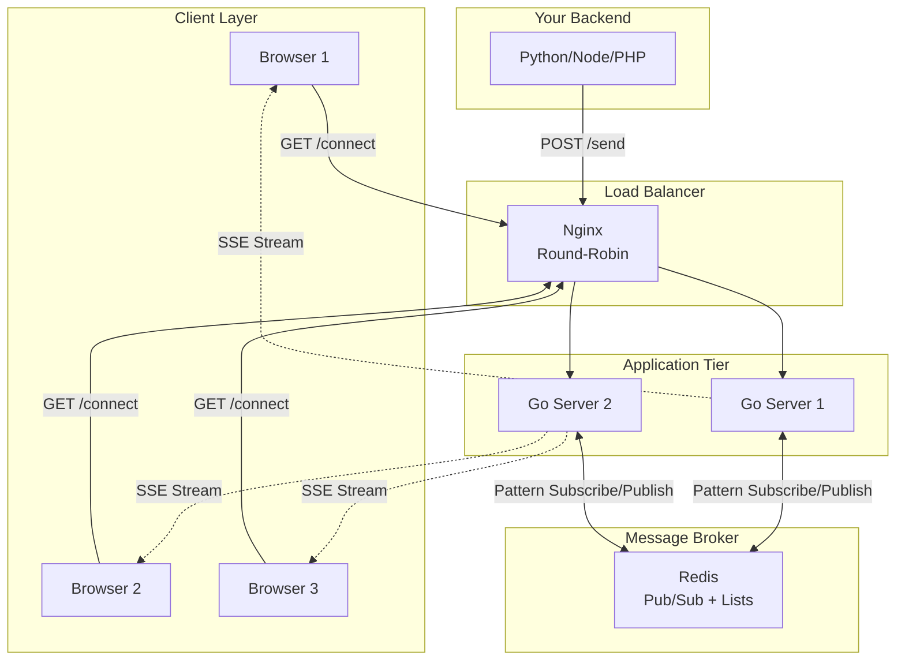

## System Overview

The engine is built on three core principles:

<CardGroup cols={3}>
  <Card title="Stateless" icon="server">
    Application servers hold no local connection state. They can crash, restart, or scale without data loss.
  </Card>
  <Card title="Distributed" icon="network-wired">
    Redis Pub/Sub pattern subscriptions synchronize all server instances in real-time.
  </Card>
  <Card title="Reliable" icon="shield-check">
    The Inbox Pattern ensures critical targeted messages persist in Redis lists until acknowledged.
  </Card>
</CardGroup>

## High-Level Architecture


---

## Component Deep Dive

### 1. Nginx Load Balancer

**Role:** Entry point for all external traffic. Distributes client connections across Go instances and acts as a security gateway.

**Key Features:**
* **SSE-optimized:** Disables proxy buffering and caching to prevent message queue latency.
* **Administrative Isolation:** Directly blocks `/send` requests (returning `403 Forbidden`) from the public internet, restricting publishing commands to the secure internal network.

---

### 2. Go Application Servers

**Role:** Handle long-lived Server-Sent Events (SSE) connections and route incoming events to client channels.

**Key Characteristics:**
* **Statelessness:** No connection metadata is persisted on the local filesystem or memory, allowing servers to crash or restart without impacting other nodes.
* **Goroutine Concurrency:** Utilizes lightweight threads (Goroutines) to scale to 10k+ concurrent streams per instance.

**Code Structure:**
```go
// ChannelMessage packages event payload with target channel
type ChannelMessage struct {
	Channel string
	Payload []byte
}

// Manager orchestrates registered SSE clients
type Manager struct {
	clients    map[string]*Client
	clientsMu  sync.RWMutex
	Register   chan *Client
	Unregister chan *Client
	Broadcast  chan ChannelMessage
}

// Client represents a single SSE connection
type Client struct {
	ID       string
	Channels map[string]bool // Set of channels client is authorized to hear
	Send     chan []byte     // Buffered channel (256 messages)
}
```

**Lifecycle:**
1. Client establishes connection via `/connect?token={JWT}` or `/connect?id={id}&channels=room_A`.
2. The server parses the connection claims, validating the JWT signature statelessly (if configured).
3. The server checks the Redis list `inbox:{id}` and flushes any pending messages to the client immediately.
4. The client is registered with the `Manager` along with its authorized channels list.
5. The gateway node's background goroutine is subscribed to the pattern `realtime:channel:*` on Redis.
6. When a message arrives from Redis, the `Manager` iterates over clients and sends the payload *only* to those subscribed to that specific channel.
7. Upon client disconnect, the node unregisters the client from the `Manager`.

---

### 3. Redis (Dual Role)

Redis handles both horizontal synchronization and message persistence:

<Tabs>
  <Tab title="Pub/Sub (Real-Time Sync)">
    **Purpose:** Synchronize messages across all stateless Go server instances.
    
    **How it works:**
    * When any Go node receives a `/send` request targeting `room_A`, it publishes it to the Redis channel `realtime:channel:room_A`.
    * All active Go gateway nodes are subscribed to the pattern `realtime:channel:*`. They receive the message and pass it to their local `Manager` for routing.
    
    **Result:** A message published to Server A is delivered instantly to a client connected to Server B.
  </Tab>
  
  <Tab title="Lists (Inbox Pattern)">
    **Purpose:** Store messages for disconnected users to guarantee at-least-once delivery.
    
    **How it works:**
    * When backend publishes to `/send` with `to_user`, the gateway pushes the message to a Redis list: `RPUSH inbox:{user_id} <message>`.
    * Upon reconnecting, the Go server fetches the backlog: `LRANGE inbox:{user_id} 0 -1` and flushes it to the client.
    * Once the client receives the backlog, it issues a `POST /ack` request, executing an atomic Lua script that deletes the queue: `DEL inbox:{user_id}`.
    
    **Result:** Messages persist in Redis (default 24h TTL) until explicitly acknowledged by the client.
  </Tab>
</Tabs>

---

## Message Flow (Step-by-Step)

Tracing a message from your backend application to a client browser:

```
[Backend] 
   |
   | 1. POST /send {channel: "room_A", data: "Hello"}
   v
[Go Node A] 
   |
   | 2. PUBLISH realtime:channel:room_A "Hello"
   v
[Redis Broker]
   |
   | 3. Broadcast to PSubscribe "realtime:channel:*"
   +-----------------------+
   |                       |
   v                       v
[Go Node A]            [Go Node B]
   |                       |
   | (No client in         | (Client 1 in room_B -> ignores)
   |  room_A -> ignore)    | (Client 2 in room_A -> client.Send <- Payload)
                           |
                           v
                       [Client 2 Browser] (Render message)
```

1. **Backend Publishes:** Your secure backend makes a POST request to `/send` targeting the channel `room_A`.
2. **Go Node A Processes:** Node A verifies the API Key, packages the event, and publishes it to Redis channel `realtime:channel:room_A`.
3. **Redis broadcasts** the message to all Go instances subscribing to `realtime:channel:*`.
4. **Go Node B Delivers:** Node B receives the message. Its `Manager` inspects all active client connections. It finds that `Client 2` is authorized for `room_A`, and routes the payload to Client 2's SSE channel.
5. **Client Renders:** Client 2 receives the data via the open SSE stream and displays the update.