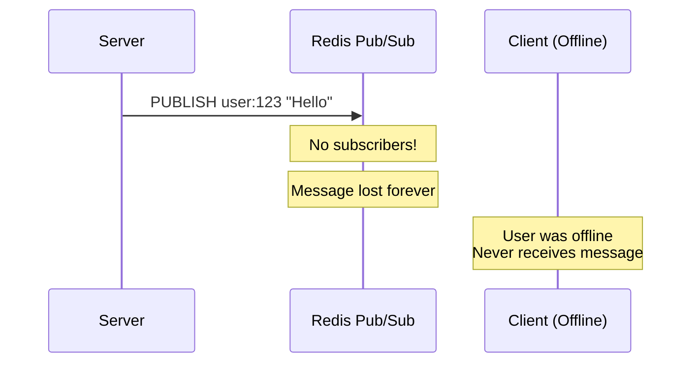
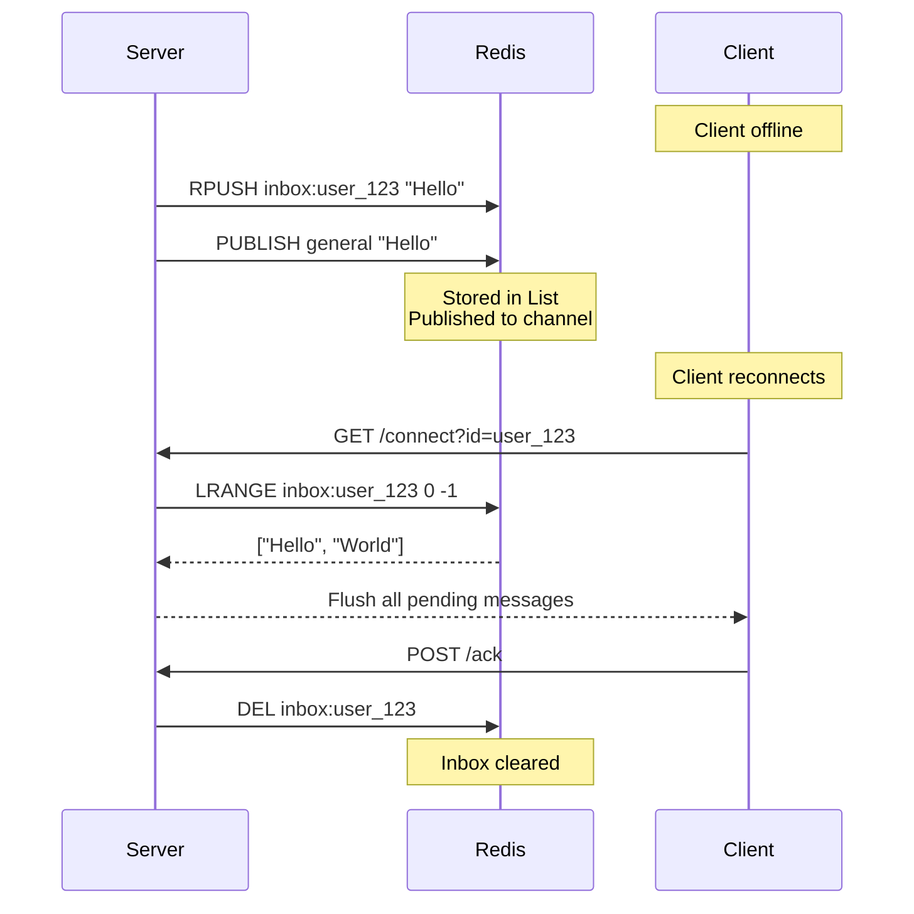

## The Problem

Traditional Pub/Sub systems are "fire-and-forget":


If a client is disconnected when a message arrives, they never receive it.

## The Solution: Inbox Pattern

The Inbox Pattern combines Pub/Sub (for real-time delivery) with persistent storage (for reliability).


## How It Works

### 1. Message Publishing

When your backend sends a message:
```python
requests.post('http://engine/send', json={
    'message': 'Your order shipped!',
    'to_user': 'user_123'
})
```

The server does two things:
```go
// 1. Save to persistent inbox
redisBroker.SaveMessage(ctx, "user_123", messageData)
// Executes: RPUSH inbox:user_123 <message>

// 2. Publish for real-time delivery
redisBroker.Publish(ctx, "general", messageData)
// Executes: PUBLISH general <message>
```

**Result:**
- If user is online: Receives immediately via Pub/Sub
- If user is offline: Message stored in Redis List

### 2. Client Reconnection

When a client connects:
```javascript
const eventSource = new EventSource('/connect?id=user_123');
```

The server:
```go
// 1. Fetch pending messages
missedMsgs, _ := redisBroker.GetPendingMessages(ctx, "user_123")
// Executes: LRANGE inbox:user_123 0 -1

// 2. Flush to client immediately
for _, msg := range missedMsgs {
    client.Send <- msg
}

// 3. Start live stream
client.ServeSSE(w, r)
```

**Result:** Client receives all missed messages instantly, then starts receiving live updates.

### 3. Acknowledgment

After processing messages, client acknowledges:
```javascript
fetch('/ack', {
  method: 'POST',
  body: JSON.stringify({ user_id: 'user_123' })
});
```

The server clears the inbox atomically:
```go
script := redis.NewScript(`
    local msgs = redis.call('LRANGE', KEYS[1], 0, -1)
    redis.call('DEL', KEYS[1])
    return msgs
`)

script.Run(ctx, b.Client, []string{"inbox:user_123"})
```

**Result:** Inbox is cleared, preventing duplicate delivery on next reconnect.

## Implementation Details

### Storing Messages
```go
func (b *RedisBroker) SaveMessage(ctx context.Context, userID string, msg []byte) error {
    key := "inbox:" + userID
    
    pipe := b.Client.Pipeline()
    pipe.RPush(ctx, key, msg)           // Append to list
    pipe.Expire(ctx, key, 24*time.Hour) // Auto-cleanup after 24h
    
    _, err := pipe.Exec(ctx)
    return err
}
```

**Why Redis Lists?**
- Ordered: Messages delivered in FIFO order
- Atomic: RPUSH is atomic, no race conditions
- Efficient: O(1) append, O(N) retrieval

**Why 24-hour TTL?**
- Prevents abandoned inboxes from growing forever
- Forces clients to reconnect within 24 hours
- Configurable based on your requirements

### Retrieving Messages
```go
func (b *RedisBroker) GetPendingMessages(ctx context.Context, userID string) ([][]byte, error) {
    key := "inbox:" + userID
    
    result, err := b.Client.LRange(ctx, key, 0, -1).Result()
    if err != nil {
        return nil, err
    }
    
    msgs := make([][]byte, len(result))
    for i, s := range result {
        msgs[i] = []byte(s)
    }
    return msgs, nil
}
```

**Why not LPOP?**
- We want to read messages without removing them
- Removal happens only after acknowledgment
- Allows retry logic if client crashes during processing

### Clearing Inbox (Atomic)
```go
func (b *RedisBroker) ClearInbox(ctx context.Context, userID string) ([][]byte, error) {
    key := "inbox:" + userID
    
    script := redis.NewScript(`
        local msgs = redis.call('LRANGE', KEYS[1], 0, -1)
        redis.call('DEL', KEYS[1])
        return msgs
    `)
    
    result, err := script.Run(ctx, b.Client, []string{key}).Result()
    // ...
}
```

**Why Lua script?**
- Redis executes scripts atomically
- Prevents race condition between read and delete
- Ensures no messages are lost during cleanup

## Delivery Guarantees

### At-Least-Once Delivery

The Inbox Pattern guarantees at-least-once delivery:

<Check>Messages are never lost due to temporary disconnects</Check>
<Check>Messages persist in Redis until acknowledged</Check>
<Check>Clients receive all messages, even if delayed</Check>

<Warning>
Possible duplicates if client receives but crashes before acknowledging. Implement client-side deduplication for exactly-once semantics.
</Warning>

### Client-Side Deduplication

For exactly-once processing:
```javascript
const processedMessages = new Set();

eventSource.onmessage = async (event) => {
  const message = JSON.parse(event.data);
  const msgId = hashMessage(message);
  
  if (processedMessages.has(msgId)) {
    console.log('Duplicate message, skipping');
    return;
  }
  
  await displayNotification(message.payload);
  processedMessages.add(msgId);
  
  localStorage.setItem('processed', JSON.stringify([...processedMessages]));
  
  await fetch('/ack', {
    method: 'POST',
    body: JSON.stringify({ user_id: userId })
  });
};
```

## Edge Cases

### What if Redis Crashes?

<AccordionGroup>
  <Accordion title="Without Redis Persistence (Default)">
    **Impact:** All inboxes are lost
    
    **Mitigation:**
    1. Messages sent during downtime are lost
    2. Enable Redis persistence (RDB or AOF)
    3. Use Redis Sentinel or Redis Cluster for HA
  </Accordion>

  <Accordion title="With Redis RDB (Snapshots)">
    **Impact:** Data loss limited to last snapshot interval
    
    **Config:**
```redis
    save 900 1
    save 300 10
    save 60 10000
```
  </Accordion>

  <Accordion title="With Redis AOF (Append-Only File)">
    **Impact:** Minimal data loss (only last few writes)
    
    **Config:**
```redis
    appendonly yes
    appendfsync everysec
```
  </Accordion>
</AccordionGroup>

### What if Client Never Acknowledges?

Messages stay in inbox until:
1. 24-hour TTL expires (automatic cleanup)
2. Client reconnects and acknowledges

**Best Practice:** Set TTL based on your use case:
- Notifications: 24 hours
- Chat messages: 7 days
- Real-time alerts: 1 hour

## Performance Characteristics

| Operation | Time Complexity | Notes |
|:----------|:----------------|:------|
| RPUSH (save) | O(1) | Constant time append |
| LRANGE (retrieve) | O(N) | N = number of pending messages |
| DEL (clear) | O(1) | Deletes key instantly |

**Typical Performance:**
- Save message: < 1ms
- Retrieve 100 messages: < 5ms
- Clear inbox: < 1ms

## Best Practices

<Check>Always set TTL on inboxes to prevent memory leaks</Check>
<Check>Implement client-side deduplication for critical flows</Check>
<Check>Monitor inbox sizes and set maximum limits</Check>
<Check>Use Redis persistence (AOF) for production</Check>
<Check>Test reconnection scenarios thoroughly</Check>

## Next Steps

<CardGroup cols={2}>
  <Card title="Scaling Guide" icon="chart-line" href="/concepts/scaling">
    Learn how to scale to millions of users
  </Card>
  <Card title="Integration Guide" icon="code" href="/guides/python-integration">
    Integrate with your backend
  </Card>
</CardGroup>