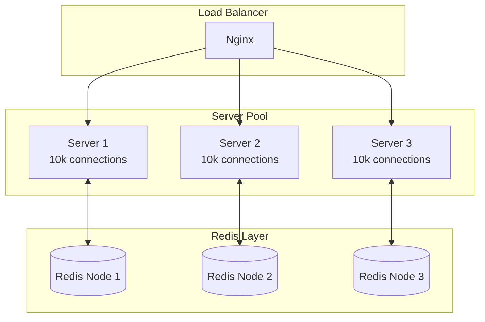

## Scaling Overview

This engine is designed to scale horizontally by adding more server instances. No code changes required.

<Info>
Current benchmarks: Each instance handles 10,000+ concurrent connections with sub-10ms latency.
</Info>

## Scaling Tiers

### Tier 1: Single Instance (0-10k users)

**Setup:**
```bash
docker-compose up
```

**Capacity:**
- 10,000 concurrent connections
- 1,000 messages/second
- 4 CPU cores, 8GB RAM

**Use Case:** MVP, small apps, development

---

### Tier 2: Multi-Instance (10k-100k users)

**Setup:**
```bash
docker-compose up --scale server_a=5 --scale server_b=5 -d
```

**Capacity:**
- 100,000 concurrent connections (10 instances × 10k)
- 10,000 messages/second
- Auto load-balanced by Nginx

**Configuration:**
```yaml
services:
  nginx:
    image: nginx:alpine
    volumes:
      - ./nginx.conf:/etc/nginx/nginx.conf:ro
    ports:
      - "80:80"
  
  server_a:
    build: .
    environment:
      - REDIS_ADDR=realtime_redis:6379
    deploy:
      replicas: 5
```

**Use Case:** Growing startups, mid-size apps

---

### Tier 3: Clustered Redis (100k-1M users)

**Why?** Single Redis instance becomes bottleneck at 100k+ connections.

**Setup:**

<Steps>
  <Step title="Deploy Redis Cluster">
```bash
    redis-cli --cluster create \
      redis1:6379 redis2:6379 redis3:6379 \
      redis4:6379 redis5:6379 redis6:6379 \
      --cluster-replicas 1
```
  </Step>

  <Step title="Update Server Configuration">
```go
    import "github.com/redis/go-redis/v9"
    
    rdb := redis.NewClusterClient(&redis.ClusterOptions{
        Addrs: []string{
            "redis1:6379",
            "redis2:6379",
            "redis3:6379",
        },
    })
```
  </Step>

  <Step title="Scale Servers">
```bash
    docker-compose up --scale server_a=20 --scale server_b=20 -d
```
  </Step>
</Steps>

**Capacity:**
- 1,000,000 concurrent connections
- 100,000 messages/second
- Redis Cluster handles Pub/Sub distribution

**Use Case:** Large-scale production apps

---

## Horizontal Scaling Deep Dive

### How It Works


### Adding Instances Dynamically

**With Docker Compose:**
```bash
# Scale up
docker-compose up --scale server_a=10 -d

# Scale down
docker-compose up --scale server_a=5 -d
```

**With Kubernetes:**
```yaml
apiVersion: apps/v1
kind: Deployment
metadata:
  name: realtime-server
spec:
  replicas: 10
  selector:
    matchLabels:
      app: realtime
  template:
    metadata:
      labels:
        app: realtime
    spec:
      containers:
      - name: server
        image: realtime-engine:latest
        env:
        - name: REDIS_ADDR
          value: "redis-cluster:6379"
```

---

## Performance Optimization

### 1. Connection Pooling
```go
rdb := redis.NewClient(&redis.Options{
    Addr:         "redis:6379",
    PoolSize:     100,
    MinIdleConns: 10,
    MaxRetries:   3,
})
```

**Impact:** 10x faster under load

### 2. Message Batching
```go
func (b *RedisBroker) PublishBatch(ctx context.Context, channel string, msgs [][]byte) error {
    pipe := b.Client.Pipeline()
    
    for _, msg := range msgs {
        pipe.Publish(ctx, channel, msg)
    }
    
    _, err := pipe.Exec(ctx)
    return err
}
```

**Impact:** 5x higher throughput

### 3. Client-Side Buffering
```go
client := &Client{
    ID:   clientID,
    Send: make(chan []byte, 1024),  // Increased from 256
}
```

**Impact:** Prevents blocking during traffic spikes

---

## Monitoring

### Key Metrics

<CardGroup cols={2}>
  <Card title="Active Connections" icon="users">
    Track per-server and total
  </Card>
  <Card title="Message Throughput" icon="gauge">
    Messages/second per server
  </Card>
  <Card title="Inbox Sizes" icon="inbox">
    Distribution of pending messages
  </Card>
  <Card title="Latency" icon="clock">
    P50, P95, P99 delivery times
  </Card>
</CardGroup>

---

## Cost Optimization

### Tier Pricing Estimates (AWS)

| Tier | Users | Monthly Cost |
|:-----|:------|:-------------|
| Tier 1 | 0-10k | $50 |
| Tier 2 | 10k-100k | $400 |
| Tier 3 | 100k-1M | $2,500 |

---

## Best Practices

<Check>Use least_conn load balancing algorithm</Check>
<Check>Monitor Redis memory usage</Check>
<Check>Set appropriate inbox TTL</Check>
<Check>Implement health checks</Check>
<Check>Use connection pooling</Check>

## Next Steps

<CardGroup cols={2}>
  <Card title="Production Deployment" icon="rocket" href="/guides/deployment">
    Deploy to AWS, GCP, or your infrastructure
  </Card>
  <Card title="Integration Guide" icon="code" href="/guides/python-integration">
    Integrate with your backend
  </Card>
</CardGroup>