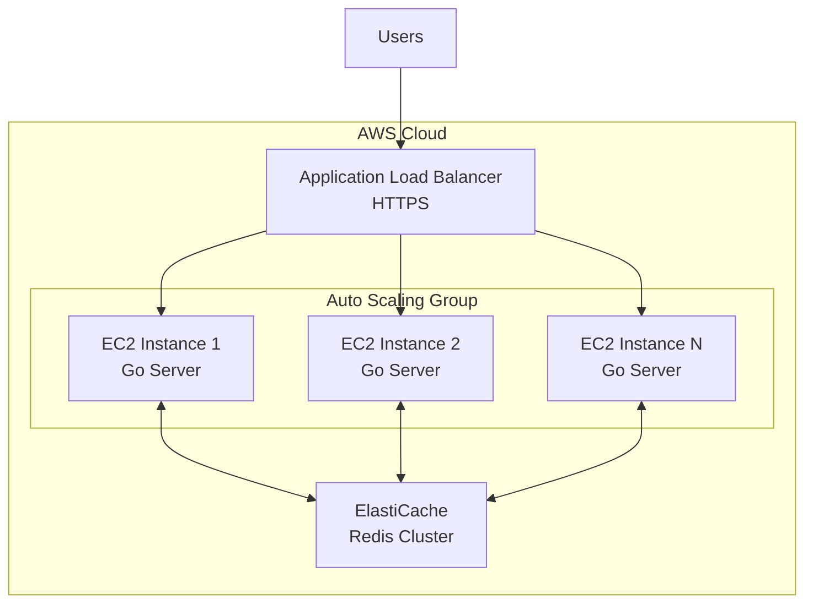
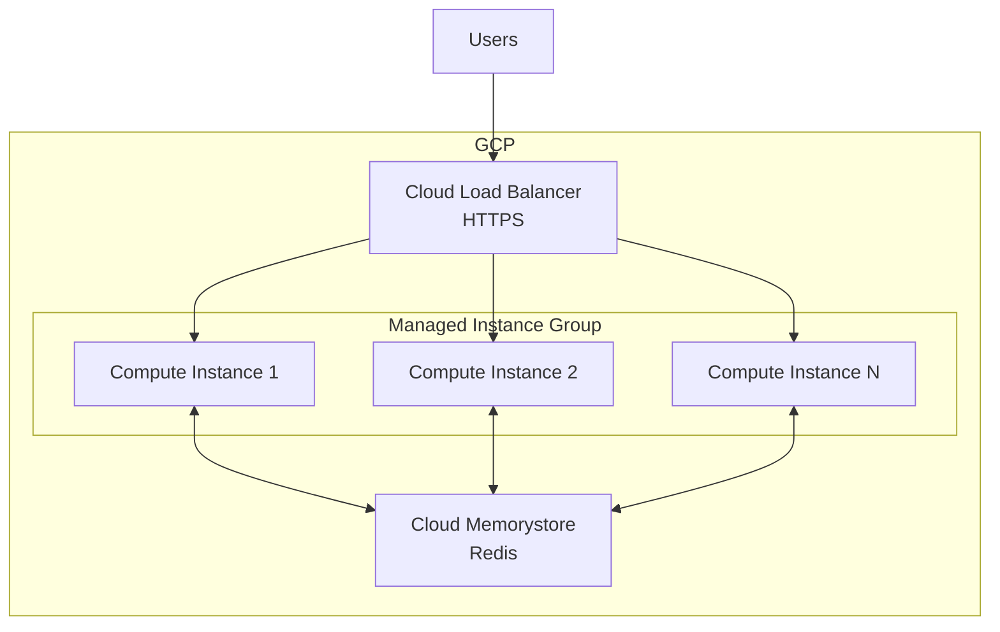

## Deployment Overview

This guide covers deploying the real-time engine to various cloud platforms.

## Prerequisites

<CardGroup cols={2}>
  <Card title="Docker" icon="docker">
    Container runtime for packaging
  </Card>
  <Card title="Redis" icon="database">
    Managed Redis service or self-hosted
  </Card>
  <Card title="Load Balancer" icon="scale-balanced">
    Nginx, HAProxy, or cloud LB
  </Card>
  <Card title="SSL Certificate" icon="lock">
    For HTTPS (required for production)
  </Card>
</CardGroup>

## AWS Deployment

### Architecture


### Step-by-Step Setup

<Steps>
  <Step title="Create ElastiCache Redis Cluster">
```bash
    aws elasticache create-cache-cluster \
      --cache-cluster-id realtime-redis \
      --engine redis \
      --cache-node-type cache.t3.medium \
      --num-cache-nodes 1 \
      --vpc-security-group-ids sg-xxxxxxxx
```
  </Step>

  <Step title="Build and Push Docker Image">
```bash
    # Build image
    docker build -t realtime-engine:latest .
    
    # Tag for ECR
    docker tag realtime-engine:latest \
      123456789.dkr.ecr.us-east-1.amazonaws.com/realtime-engine:latest
    
    # Push to ECR
    aws ecr get-login-password --region us-east-1 | \
      docker login --username AWS --password-stdin \
      123456789.dkr.ecr.us-east-1.amazonaws.com
    
    docker push 123456789.dkr.ecr.us-east-1.amazonaws.com/realtime-engine:latest
```
  </Step>

  <Step title="Create ECS Task Definition">
```json
    {
      "family": "realtime-engine",
      "networkMode": "awsvpc",
      "containerDefinitions": [
        {
          "name": "realtime-server",
          "image": "123456789.dkr.ecr.us-east-1.amazonaws.com/realtime-engine:latest",
          "portMappings": [
            {
              "containerPort": 8080,
              "protocol": "tcp"
            }
          ],
          "environment": [
            {
              "name": "REDIS_ADDR",
              "value": "realtime-redis.cache.amazonaws.com:6379"
            }
          ],
          "logConfiguration": {
            "logDriver": "awslogs",
            "options": {
              "awslogs-group": "/ecs/realtime-engine",
              "awslogs-region": "us-east-1",
              "awslogs-stream-prefix": "ecs"
            }
          }
        }
      ],
      "requiresCompatibilities": ["FARGATE"],
      "cpu": "512",
      "memory": "1024"
    }
```
  </Step>

  <Step title="Create ECS Service with Auto Scaling">
```bash
    aws ecs create-service \
      --cluster realtime-cluster \
      --service-name realtime-service \
      --task-definition realtime-engine \
      --desired-count 3 \
      --launch-type FARGATE \
      --load-balancers targetGroupArn=arn:aws:...,containerName=realtime-server,containerPort=8080
    
    # Configure auto scaling
    aws application-autoscaling register-scalable-target \
      --service-namespace ecs \
      --resource-id service/realtime-cluster/realtime-service \
      --scalable-dimension ecs:service:DesiredCount \
      --min-capacity 3 \
      --max-capacity 10
    
    aws application-autoscaling put-scaling-policy \
      --policy-name cpu-scaling \
      --service-namespace ecs \
      --resource-id service/realtime-cluster/realtime-service \
      --scalable-dimension ecs:service:DesiredCount \
      --policy-type TargetTrackingScaling \
      --target-tracking-scaling-policy-configuration \
        '{"TargetValue":70.0,"PredefinedMetricSpecification":{"PredefinedMetricType":"ECSServiceAverageCPUUtilization"}}'
```
  </Step>

  <Step title="Configure Application Load Balancer">
```bash
    # Create target group
    aws elbv2 create-target-group \
      --name realtime-targets \
      --protocol HTTP \
      --port 8080 \
      --vpc-id vpc-xxxxxxxx \
      --health-check-path /
    
    # Create load balancer
    aws elbv2 create-load-balancer \
      --name realtime-alb \
      --subnets subnet-xxxxx subnet-yyyyy \
      --security-groups sg-xxxxxxxx
    
    # Add HTTPS listener
    aws elbv2 create-listener \
      --load-balancer-arn arn:aws:... \
      --protocol HTTPS \
      --port 443 \
      --certificates CertificateArn=arn:aws:acm:... \
      --default-actions Type=forward,TargetGroupArn=arn:aws:...
```
  </Step>
</Steps>

### Cost Estimate (Monthly)

| Service | Configuration | Cost |
|:--------|:--------------|:-----|
| **ECS Fargate** | 3 tasks (512 CPU, 1GB RAM) | $45 |
| **ElastiCache** | cache.t3.medium | $50 |
| **Application Load Balancer** | Standard ALB | $20 |
| **Data Transfer** | 1TB/month | $90 |
| **Total** | | **$205/month** |

---

## Google Cloud Platform (GCP)

### Architecture


### Setup with Cloud Run

<Steps>
  <Step title="Create Memorystore Redis">
```bash
    gcloud redis instances create realtime-redis \
      --size=1 \
      --region=us-central1 \
      --tier=basic
```
  </Step>

  <Step title="Build and Deploy to Cloud Run">
```bash
    # Build with Cloud Build
    gcloud builds submit --tag gcr.io/PROJECT_ID/realtime-engine
    
    # Deploy to Cloud Run
    gcloud run deploy realtime-service \
      --image gcr.io/PROJECT_ID/realtime-engine \
      --platform managed \
      --region us-central1 \
      --allow-unauthenticated \
      --set-env-vars REDIS_ADDR=10.0.0.3:6379 \
      --vpc-connector realtime-connector \
      --min-instances 3 \
      --max-instances 10 \
      --cpu 1 \
      --memory 512Mi
```
  </Step>

  <Step title="Create VPC Connector">
```bash
    gcloud compute networks vpc-access connectors create realtime-connector \
      --region us-central1 \
      --range 10.8.0.0/28
```
  </Step>
</Steps>

---

## Digital Ocean

### Setup with App Platform

<Steps>
  <Step title="Create Managed Redis">
```bash
    doctl databases create realtime-redis \
      --engine redis \
      --region nyc3 \
      --size db-s-1vcpu-1gb
```
  </Step>

  <Step title="Deploy via App Platform">
    Create `app.yaml`:
```yaml
    name: realtime-engine
    region: nyc
    
    services:
    - name: realtime-server
      dockerfile_path: Dockerfile
      github:
        repo: yourusername/real-time-serverless-communication
        branch: main
      health_check:
        http_path: /
      http_port: 8080
      instance_count: 3
      instance_size_slug: basic-xs
      envs:
      - key: REDIS_ADDR
        value: ${realtime-redis.HOSTNAME}:${realtime-redis.PORT}
    
    databases:
    - name: realtime-redis
      engine: REDIS
      production: true
```
    
    Deploy:
```bash
    doctl apps create --spec app.yaml
```
  </Step>
</Steps>

---

## Self-Hosted (VPS)

### Setup with Docker Swarm

<Steps>
  <Step title="Initialize Swarm">
```bash
    # On manager node
    docker swarm init
    
    # On worker nodes
    docker swarm join --token SWMTKN-xxx manager-ip:2377
```
  </Step>

  <Step title="Deploy Stack">
    Create `docker-stack.yml`:
```yaml
    version: '3.8'
    
    services:
      nginx:
        image: nginx:alpine
        ports:
          - "80:80"
          - "443:443"
        volumes:
          - ./nginx.conf:/etc/nginx/nginx.conf:ro
          - ./certs:/etc/nginx/certs:ro
        deploy:
          replicas: 1
          placement:
            constraints:
              - node.role == manager
    
      server:
        image: yourregistry/realtime-engine:latest
        environment:
          - REDIS_ADDR=redis:6379
        deploy:
          replicas: 5
          update_config:
            parallelism: 2
            delay: 10s
          restart_policy:
            condition: on-failure
    
      redis:
        image: redis:alpine
        volumes:
          - redis-data:/data
        command: redis-server --appendonly yes
        deploy:
          replicas: 1
          placement:
            constraints:
              - node.role == manager
    
    volumes:
      redis-data:
```
    
    Deploy:
```bash
    docker stack deploy -c docker-stack.yml realtime
```
  </Step>
</Steps>

---

## SSL/TLS Configuration

### Nginx SSL Setup
```nginx
server {
    listen 80;
    server_name realtime.yourdomain.com;
    return 301 https://$server_name$request_uri;
}

server {
    listen 443 ssl http2;
    server_name realtime.yourdomain.com;

    ssl_certificate /etc/nginx/certs/fullchain.pem;
    ssl_certificate_key /etc/nginx/certs/privkey.pem;
    ssl_protocols TLSv1.2 TLSv1.3;
    ssl_ciphers HIGH:!aNULL:!MD5;

    location /connect {
        proxy_pass http://backend;
        proxy_http_version 1.1;
        proxy_set_header Upgrade $http_upgrade;
        proxy_set_header Connection "";
        proxy_set_header Host $host;
        proxy_buffering off;
        proxy_cache off;
        proxy_read_timeout 86400;
    }

    location / {
        proxy_pass http://backend;
        proxy_set_header Host $host;
        proxy_set_header X-Real-IP $remote_addr;
    }
}
```

### Let's Encrypt with Certbot
```bash
# Install Certbot
sudo apt-get install certbot python3-certbot-nginx

# Get certificate
sudo certbot --nginx -d realtime.yourdomain.com

# Auto-renewal
sudo certbot renew --dry-run
```

---

## Monitoring

### Prometheus Metrics

Add to your Go server:
```go
import (
    "github.com/prometheus/client_golang/prometheus"
    "github.com/prometheus/client_golang/prometheus/promhttp"
)

var (
    activeConnections = prometheus.NewGauge(prometheus.GaugeOpts{
        Name: "realtime_active_connections",
        Help: "Number of active SSE connections",
    })
    
    messagesSent = prometheus.NewCounter(prometheus.CounterOpts{
        Name: "realtime_messages_sent_total",
        Help: "Total number of messages sent",
    })
)

func init() {
    prometheus.MustRegister(activeConnections)
    prometheus.MustRegister(messagesSent)
}

func main() {
    // Metrics endpoint
    http.Handle("/metrics", promhttp.Handler())
    
    // ... rest of server
}
```

### Grafana Dashboard

Import dashboard for visualization:
```json
{
  "dashboard": {
    "title": "Real-Time Engine",
    "panels": [
      {
        "title": "Active Connections",
        "targets": [
          {
            "expr": "realtime_active_connections"
          }
        ]
      },
      {
        "title": "Messages/sec",
        "targets": [
          {
            "expr": "rate(realtime_messages_sent_total[1m])"
          }
        ]
      }
    ]
  }
}
```

---

## Security Best Practices

<Check>Always use HTTPS in production</Check>
<Check>Implement rate limiting at load balancer</Check>
<Check>Use authentication for /send endpoint</Check>
<Check>Keep Redis in private subnet</Check>
<Check>Enable Redis AUTH password</Check>
<Check>Use security groups/firewalls</Check>
<Check>Regular security updates</Check>

---

## Health Checks

Add health check endpoint:
```go
r.Get("/health", func(w http.ResponseWriter, r *http.Request) {
    // Check Redis
    if err := redisBroker.Client.Ping(context.Background()).Err(); err != nil {
        w.WriteHeader(http.StatusServiceUnavailable)
        w.Write([]byte(`{"status":"unhealthy","redis":"down"}`))
        return
    }
    
    w.Write([]byte(`{"status":"healthy"}`))
})
```

---

## Backup and Recovery

### Redis Backup
```bash
# Enable AOF persistence
redis-cli CONFIG SET appendonly yes

# Manual snapshot
redis-cli BGSAVE

# Automated backups (cron)
0 2 * * * redis-cli BGSAVE && cp /var/lib/redis/dump.rdb /backup/
```

---

## Next Steps

<CardGroup cols={2}>
  <Card
    title="Scaling Guide"
    icon="chart-line"
    href="/concepts/scaling"
  >
    Learn how to scale to millions of users
  </Card>
  <Card
    title="Examples"
    icon="lightbulb"
    href="/examples/notifications"
  >
    See real-world implementations
  </Card>
</CardGroup>